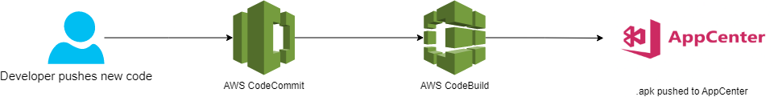

1. Create an account in AppCenter
2. Create a new app
3. Open the app -> go to Distribute -> go to Groups -> Create new Distribution groups
4. Open buildspec.yml
5. Go to line 25 and replace <1>,<2>,<3> following this link https://appcenter.ms/users/<2>/apps/<1>/distribute/distribution-groups/<3>/overview

AWS CodeBuild Environment: 
- environment type: Linux
- image: aws/codebuild/standard:4.0

